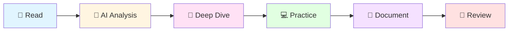

# 🔬 Dev Book Lab

<div align="center">

**AI와 함께 개발 서적을 분석하고 정리하는 연구소**

[](https://github.com/dev-book-lab)
[](https://hits.seeyoufarm.com)

</div>

---

## 🎯 Mission
```
📖 Read → 🤖 Analyze → 💻 Practice → 📝 Document
```

개발 서적의 핵심 개념을 AI와 함께 **깊이 있게 분석**하고,  
실전에 **바로 적용**할 수 있는 형태로 재구성합니다.

## 📚 Current Studies

<table>
  <tr>
    <td align="center" width="33%">
      
      <br/>
      <b>Modern Java in Action</b>
      <br/>
      <a href="https://github.com/dev-book-lab/modern-java-in-action">📖 Go to repository</a>
      <br/>
      <sub>자바 8+ 함수형 프로그래밍</sub>
    </td>
    <td align="center" width="33%">
      
      <br/>
      <b>Next Book</b>
      <br/>
      <sub>준비 중...</sub>
    </td>
    <td align="center" width="33%">
      
      <br/>
      <b>Next Book</b>
      <br/>
      <sub>준비 중...</sub>
    </td>
  </tr>
</table>

## 🛠️ Study Method


| Step | Description |
|------|-------------|
| 📖 **Read** | 책 내용을 꼼꼼히 학습 |
| 🤖 **Analyze** | AI(Claude)와 대화하며 개념 분석 |
| 💭 **Deep Dive** | 궁금한 점을 질문하고 깊이 파고들기 |
| 💻 **Practice** | 예제 코드 작성 및 실습 |
| 📝 **Document** | 이해한 내용을 나만의 언어로 정리 |
| 🔄 **Review** | 반복 학습 및 개선 |

## 💡 Philosophy

<div align="center">

> *"단순히 정리하는 것이 아니라,*  
> *AI와 대화하며 깊이 이해하고,*  
> *나만의 언어로 재해석합니다."*

</div>

### Why AI-Assisted Learning?

- 🎯 **즉각적인 피드백**: 궁금한 점을 바로 질문하고 답을 얻습니다
- 🔍 **다각도 분석**: 하나의 개념을 여러 관점에서 이해합니다
- 💬 **대화형 학습**: 단순 암기가 아닌 이해 중심의 학습
- 📊 **맞춤형 설명**: 내 수준에 맞는 설명과 예제

## 🔗 About

<div align="center">

**Learning through dialogue with AI**

*깊이 있는 이해를 위한 실험적 학습 여정*

<br/>

[](https://github.com/dev-book-lab)

</div>

---

<div align="center">

### 📬 Contact & Links

[](https://github.com/dev-book-lab)
[](mailto:lee038129@naver.com)

<br/>

**⭐️ 도움이 되셨다면 Star를 눌러주세요!**

<sub>Last updated: 2024</sub>

</div>
