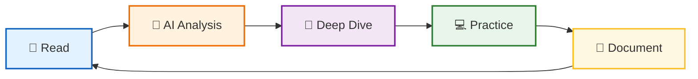

# 🔬 Dev Book Lab

**AI와 함께 개발 서적을 분석하고 정리하는 연구소**

 

> *"Read → Analyze → Practice → Document → Repeat"*

개발 서적의 핵심 개념을 AI와 함께 **깊이 있게 분석**하고,  
실전에 **바로 적용**할 수 있는 형태로 재구성합니다.

---

## 📚 Current Studies

| 📖 Book | 🏷️ Topics | 🔗 Link |
|---------|----------|---------|
| **Modern Java in Action** | 자바 8+ 함수형 프로그래밍, 스트림 API, 람다 | [📂 Repository](https://github.com/dev-book-lab/modern-java-in-action) |
| **오브젝트 (Objects)** | 코드로 이해하는 객체지향 설계, 역할/책임/협력 | [📂 Repository](./object) |

💡 다음 책은 학습 완료 후 선정 예정

 

## 🛠️ Study Method

| Step | Description |
|------|-------------|
| 📖 **Read** | 책 내용을 정독하며 핵심 개념 파악 |
| 🤖 **Analyze** | AI(Claude)와 대화하며 개념의 본질 분석 |
| 💭 **Deep Dive** | "왜?"라는 질문을 통해 원리 심층 탐구 |
| 💻 **Practice** | 실제 코드로 검증 및 변형 실습 |
| 📝 **Document** | 나만의 언어로 재해석하여 정리 |

 

## 💡 Philosophy

> **"단순한 요약은 AI도 할 수 있습니다.**  
> **우리는 AI와 대화하며 얻은 통찰(Insight)을 기록합니다."**

### Why AI-Assisted Learning?

- 🎯 **즉각적 피드백** - 궁금한 점을 바로 질문하고 답을 얻습니다
- 🔍 **다각도 분석** - 하나의 개념을 여러 관점에서 이해합니다
- 💬 **대화형 학습** - 단순 암기가 아닌 이해 중심의 학습
- 📊 **맞춤형 설명** - 내 수준에 맞는 설명과 예제

 

## 🔗 About

*AI와 대화하며 기술을 깊이 이해하는 개발자의 학습 기록*

 

**⭐️ 도움이 되셨다면 Star를 눌러주세요!**

