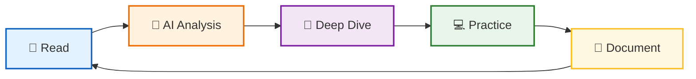

# 🔬 Dev Book Lab

**AI와 함께 개발 서적을 분석하고 정리하는 연구소**

 

> *"Read → Analyze → Practice → Document → Repeat"*

개발 서적의 핵심 개념을 AI와 함께 **깊이 있게 분석**하고,  
실전에 **바로 적용**할 수 있는 형태로 재구성합니다.

---

## 📚 Projects & Studies

| 📌 Title | 📝 Key Topics | 🔗 Link |
|:---------|:----------|:---------|
| **Java API Reference** | **자바 표준 라이브러리 원리**, 실무 패턴, 성능 최적화, 실행 가능한 예제 | [📂 Repository](https://github.com/dev-book-lab/java-api-reference) |
| **Modern Java in Action** | 자바 8+ 함수형 프로그래밍, 스트림 API, 람다 | [📂 Repository](https://github.com/dev-book-lab/modern-java-in-action) |
| **JVM Deep Dive** | **JVM 내부 구조 완전 해부**, 클래스 로딩/GC/JIT/메모리 모델, CPU 레벨 분석, 성능 튜닝 | [📂 Repository](https://github.com/dev-book-lab/jvm-deep-dive) |
| **오브젝트 (Objects)** | 코드로 이해하는 객체지향 설계, 역할/책임/협력 | [📂 Repository](https://github.com/dev-book-lab/object) |
| **Java Design Patterns** | **47가지 디자인 패턴**, GoF/아키텍처/동시성 패턴, 실전 Before/After 비교 | [📂 Repository](https://github.com/dev-book-lab/java-design-patterns) |
| **Docker Deep Dive** | **Namespaces/Cgroups/UnionFS**, 이미지 최적화, 네트워킹/보안 원리, 실전 트러블슈팅 | [📂 Repository](https://github.com/dev-book-lab/docker-deep-dive) |
| **Git In-Depth** | **Git 내부 구조(Object Model)**, 복잡한 충돌 해결, Rebase 심화, 실전 트러블슈팅 | [📂 Repository](https://github.com/dev-book-lab/git-in-depth) |

💡 지속적으로 새로운 학습 프로젝트가 추가될 예정입니다.

 

## 🛠️ Study Method

| Step | Description |
|------|-------------|
| 📖 **Read** | 책 내용을 정독하며 핵심 개념 파악 |
| 🤖 **Analyze** | AI(Claude)와 대화하며 개념의 본질 분석 |
| 💭 **Deep Dive** | "왜?"라는 질문을 통해 원리 심층 탐구 |
| 💻 **Practice** | 실제 코드로 검증 및 변형 실습 |
| 📝 **Document** | 나만의 언어로 재해석하여 정리 |

 

## 💡 Philosophy

> **"단순한 요약은 AI도 할 수 있습니다.**  
> **우리는 AI와 대화하며 얻은 통찰(Insight)을 기록합니다."**

### Why AI-Assisted Learning?

- 🎯 **즉각적 피드백** - 궁금한 점을 바로 질문하고 답을 얻습니다
- 🔍 **다각도 분석** - 하나의 개념을 여러 관점에서 이해합니다
- 💬 **대화형 학습** - 단순 암기가 아닌 이해 중심의 학습
- 📊 **맞춤형 설명** - 내 수준에 맞는 설명과 예제

 

## 🔗 About

*AI와 대화하며 기술을 깊이 이해하는 개발자의 학습 기록*

 

**⭐️ 도움이 되셨다면 Star를 눌러주세요!**

